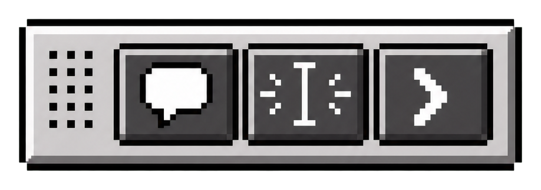

<p align="center">
  
</p>

<h1 align="center">Promplet</h1>

<p align="center"><strong>A tiny prompt strip that types saved text without touching the clipboard.</strong></p>

<p align="center">
  <a href="https://github.com/Tyler-Systems/Promplet/releases/download/v0.1.0-alpha.4/Promplet-v0.1.0-alpha.4-windows-x86_64.zip"><strong>Download for Windows</strong></a>
  &nbsp;·&nbsp;
  <a href="#build-from-source">Build from source</a>
  &nbsp;·&nbsp;
  <a href="LICENSE">MIT license</a>
</p>

<p align="center">
  <a href="docs/promplet-windows.png"></a>
</p>

Promplet is a tiny, always-available prompt strip inspired by the Classic Mac
OS Control Strip. Click a button and its saved text is inserted into the
previously focused text box without reading or changing the clipboard.

## Windows alpha

The `v0.1.0-alpha.4` checkpoint is a portable Windows x86-64 app: extract the
ZIP and run `promplet.exe`. There is no installer, background service,
auto-updater, or telemetry.

Windows may show a security warning because this early build is not
code-signed.

## Use

- Click a prompt to insert its text.
- Right-click a prompt to edit, duplicate, add after, or delete it.
- Drag the dotted grip to move the strip.
- Right-click the grip to add a prompt, switch orientation, reveal or reload
  the config file, or quit.

The strip can remain horizontal or rotate 90° clockwise into a narrow vertical
bar while its menus and editor stay upright.

<p align="center">
  <a href="docs/promplet-windows-vertical.png"></a>
</p>

Promplet starts just above the taskbar. You may drag it over the taskbar, and
its topmost behavior yields while another application is truly full-screen.
Launching Promplet again raises the existing strip instead of starting a
duplicate process.

Settings are stored as readable JSON at:

```text
%LOCALAPPDATA%\Promplet\promplets.json
```

Use **Show Config File** from the grip menu to open that folder for backup or
transfer. After editing or replacing the JSON file, choose **Reload Config** to
apply it without restarting Promplet. A malformed file reports an error and
leaves the current prompts untouched.

## Build from source

Prerequisites:

- Rust stable with the `x86_64-pc-windows-msvc` target
- Visual Studio 2022 Build Tools with the C++ workload and Windows SDK

```powershell
cargo test
cargo run --release
```

Debug builds keep a console window for diagnostics; release builds use the
Windows GUI subsystem.

## Current scope

Windows is implemented first. Native macOS and Linux input/window backends are
planned, but not present in this alpha.

- Windows prevents input injection into an elevated app unless Promplet is
  elevated too.
- Some applications and secure text fields intentionally reject synthetic
  keyboard input.

## License

[MIT](LICENSE)
